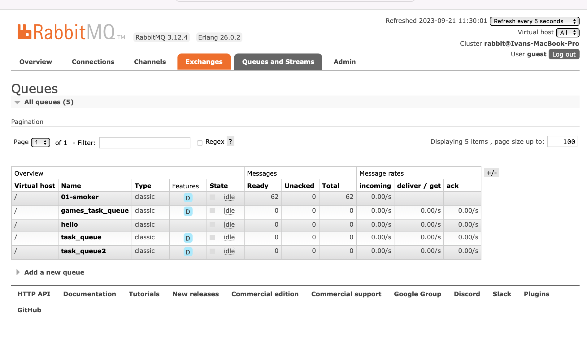

# Streaming-05-smart-smoker + P6: Consumers, Windowing, and Multiple Channels
- Author: Ivan Quackenbush
- Date: September 28, 2023

This module takes data from a CSV file and sends it off using a producer to multiple channels. This information shows how the temperature of the smoker at a given time so a user would not have to manually check it frequently. The second part of this project takes the data that the producer creates and uses multiple consumers to process it. The consumers show the temperature and give alerts in relation to different variables.

## Prerequisites

1. Git
1. Python 3.7+ (3.11+ preferred)
1. VS Code Editor
1. VS Code Extension: Python (by Microsoft)

The following modules are required: 

| Module          | Version  |
|-----------------|----------|
| csv             | 1.0      |
| webbrowser      | 3.11.4   |
| sys             | 3.11.4   |
| time            | 3.11.4   |
| pika            | 1.3.2    |

## Terminals Screenshots

See a running example

## Suggested Readings

1. Read the [RabbitMQ Tutorial - Work Queues](https://www.rabbitmq.com/tutorials/tutorial-two-python.html)
1. Read the code and comments in this repo.

- [RabbitMQ Tutorial - Work Queues](https://www.rabbitmq.com/tutorials/tutorial-two-python.html)

## Module 6 Work

1. Food A Monitor:
The Food A Monitor tracks real-time temperature data for a specific food item. If the temperature changes by 1°F or less over the last 20 readings, it alerts of potential stalling.

2. Food B Monitor:
The Food B Monitor continuously observes temperature readings for another food item. Similar to Food A, it raises an alert if it detects minimal temperature changes, hinting at possible stalling.

3. Smoker Monitor:
This monitor oversees temperature fluctuations within a smoker apparatus. It sends out an alert if there's a temperature swing of 15°F or more over recent readings, signaling potential irregularities.

## Smoker Producer and Consumer RabbitMQ

## Smoker Producer and Consumer Running Terminal 
